# TaskFlow Full System Architecture & Data Flow Documentation

TaskFlow is a production-grade team management and collaboration platform built with Next.js 15, React 19, TypeScript, PostgreSQL, Prisma, Clerk, Liveblocks, and Inngest.

---

## 1. System Architecture Overview (`architecture.drawio`)

The system is structured into four main operational layers:
1. **Client UI & Page Architecture Layer**: Framed hero landing page, Clerk authentication & workspace selector, organization dashboard with admin auto-folder creation toggle, protected nested folder hierarchy tree (Main > Year > Month > Day), interactive board views (Kanban, Timeline, Calendar), task card modal with subtasks & attachments, real-time header notification center with Discord integration, focus time tracker stopwatch with manual start memory, daily analytics charts with member comparison scorecard, workspace audit logs, trash bin 30-day retention drawer, and sidebar workspace navigation.
2. **Backend Controllers & Server Actions Layer**: Clerk Auth & roles middleware guarding Admin vs Member access permissions, Org Settings API (`/api/organization/settings`), Prisma Server Actions (`updateCard`, `createBoard`, `restoreItem`, `deletePermanently`), Pending Tasks API (`/api/tasks/me/pending`), Daily Activity API (`/api/analytics/daily-activity`), Global Search API (`/api/search`), File Attachment Upload API (`/api/attachments/upload`), and automated cron routes (`/api/cron/cleanup-trash` & `/api/cron/reset-imp-board`).
3. **Real-Time & Background Engines Layer**: Inngest background worker engine automatically generating Year, Month, and Day subfolders based on system date, Liveblocks WebSockets engine handling live multiplayer cursors and real-time settings broadcast (`ORG_SETTINGS_UPDATED`), and Notification Dispatch Engine managing in-app header bell alerts alongside Discord Webhook channel notifications (`channel: "discord"`).
4. **PostgreSQL Database Layer (Prisma ORM)**: Multi-tenant Clerk organizations and role memberships, `OrgSettings` (`orgId`, `autoFolderCreation`), protected folder tree schema (`Folder`, `YearFolder`, `MonthFolder`, `DayFolder`), Kanban core models (`Board`, `List`, `Card`, `Subtask`), tags (`Tag`, `CardTag`), metadata & logging (`Comment`, `Attachment`, `CardAssignment`, `AuditLog`), and notification preferences (`Notification` with `channel="discord"` & `FolderAccess`).

---

## 2. Text Visual Flowchart (`architecture.txt` equivalent)

```text
========================================================================================================================
                                    TASKFLOW - FULL SYSTEM ARCHITECTURE & DATA FLOW
========================================================================================================================

┌──────────────────────────────────────────────────────────────────────────────────────────────────────────────────────┐
│ 1. CLIENT UI & PAGE ARCHITECTURE LAYER (Next.js 15, React 19, Tailwind CSS, Radix UI, Lucide Icons)                  │
└──────────────────────────────────────────────────────────────────────────────────────────────────────────────────────┘
   │
   ├─► [1. Marketing Landing Page] ────────────► Framed Hero (No Scrollbars) + TaskFlow Custom Vector Logo
   │
   ├─► [2. Auth & Team Onboarding] ────────────► Clerk Sign In / Sign Up ──► Org Selector ──► Admin vs Member Roles
   │
   ├─► [3. Main Dashboard & Admin] ────────────► Active Boards Grid + Admin Permanent Auto-Folder Creation Toggle
   │                                                 ▲ Liveblocks WebSockets Real-Time Sync Across All Tabs
   │
   ├─► [4. Protected Folder Hierarchy] ────────► [Main Folder] ──► [Year Folder] ──► [Month Folder] ──► [Day Folder]
   │                                                 ▲ Password Privacy Protection & Member Access Controls
   │
   ├─► [5. Interactive Board Views] ───────────► Kanban Columns ──► Timeline View ──► Calendar Grid View
   │                                                 ▲ Unsplash Wallpapers, Starred Bookmarks & Card Status Badges
   │
   ├─► [6. Task Cards & Subtasks Modal] ───────► Task Assignments + Subtasks % Bar + Image/Link Attachments
   │                                                 ▲ Comments + Priority Tags (High/Med/Low) + Status Tracking
   │
   ├─► [7. Real-Time Bell Notifications] ──────► In-App Header Bell Alerts + Discord Webhook Dispatch (channel: discord)
   │
   ├─► [8. Focus Time Tracker Stopwatch] ──────► Start / Pause / Reset / Done Controls + Manual Start Memory
   │
   ├─► [9. Daily Analytics & Charts] ──────────► Daily / Overall Range Switcher + Member Filter + Admin Comparison Trophy
   │
   ├─► [10. Workspace Activity Audit Logs] ────► Real-Time AuditLog Feed (CREATE, UPDATE, DELETE) with Avatars
   │
   ├─► [11. Trash Bin & Auto Purge Drawer] ────► 30-Day Retention Countdown + 1-Click Restore + 1-Click Empty Trash
   │
   └─► [12. Sidebar Workspace Navigation] ─────► Starred Board Bookmarks + Accordion Switcher + Quick Link Menu
   │
   ▼
┌──────────────────────────────────────────────────────────────────────────────────────────────────────────────────────┐
│ 2. BACKEND CONTROLLERS & SERVER ACTIONS LAYER (Next.js Server Actions, REST API, Clerk Middleware)                    │
└──────────────────────────────────────────────────────────────────────────────────────────────────────────────────────┘
   │
   ├─► [Clerk Middleware] ─────────────────────► Session Verification & Admin vs Member Role Permission Guard
   │
   ├─► [Org Settings API] ─────────────────────► GET / PATCH /api/organization/settings (autoFolderCreation toggle)
   │
   ├─► [Prisma Server Actions Engine] ─────────► updateCard, createBoard, restoreItem, deletePermanently
   │
   ├─► [Pending Tasks API] ────────────────────► GET /api/tasks/me/pending (Filters assigned active tasks for Time Tracker)
   │
   ├─► [Daily Activity API] ───────────────────► GET /api/analytics/daily-activity (Calculates Daily & Overall stats)
   │
   ├─► [Global Search & Upload API] ───────────► GET /api/search & POST /api/attachments/upload
   │
   └─► [Automated Cron Routes] ────────────────► /api/cron/cleanup-trash (30-day purge) & /api/cron/reset-imp-board
   │
   ▼
┌──────────────────────────────────────────────────────────────────────────────────────────────────────────────────────┐
│ 3. REAL-TIME & BACKGROUND ENGINES LAYER                                                                               │
└──────────────────────────────────────────────────────────────────────────────────────────────────────────────────────┘
   │
   ├─► [Inngest Background Worker Engine] ─────► Automated Year, Month, and Day folder generation based on date
   │
   ├─► [Liveblocks WebSockets Engine] ─────────► Real-time multiplayer cursors & ORG_SETTINGS_UPDATED live broadcast
   │
   └─► [Notification Engine & Discord] ────────► Header bell alert dispatch & Discord webhook channel integration
   │
   ▼
┌──────────────────────────────────────────────────────────────────────────────────────────────────────────────────────┐
│ 4. POSTGRESQL DATABASE & STORAGE LAYER (Prisma ORM)                                                                  │
└──────────────────────────────────────────────────────────────────────────────────────────────────────────────────────┘
   │
   ├── OrgSettings ──────────► (orgId, autoFolderCreation)
   ├── Multi-Tenant Orgs ────► (Clerk Organization & Membership Roles: Admin vs Member)
   ├── Folder Tree ──────────► (Folder ──► YearFolder ──► MonthFolder ──► DayFolder ──► Board)
   ├── Folder Privacy ───────► (FolderAccess, Password Hash)
   ├── Kanban Core ──────────► (Board ──► List ──► Card ──► Subtask)
   ├── Metadata & Tags ──────► (Tag, CardTag, Comment, Attachment)
   ├── Task Assignments ─────► (CardAssignment, User Avatars)
   ├── System Logging ───────► (AuditLog: CREATE, UPDATE, DELETE)
   └── Notifications ────────► (Notification: channel="discord", isRead, actorName)
========================================================================================================================
```

---

## 3. Interactive Mermaid Architecture Diagram

```mermaid
flowchart TD
    subgraph UI ["1. Client UI & Page Architecture Layer"]
        Hero["1. Landing Page (TaskFlow Logo, No Scrollbars)"]
        Auth["2. Clerk Auth & Workspace Switcher"]
        Dash["3. Main Dashboard & Admin Folder Toggle"]
        FolderTree["4. Protected Folder Tree (Year > Month > Day)"]
        Board["5. Board Views (Kanban, Timeline, Calendar)"]
        Cards["6. Task Cards, Subtasks & Attachments"]
        NotifBell["7. Real-Time Bell Icon Notifications"]
        TimeTracker["8. Focus Time Tracker (Manual Start Memory)"]
        Analytics["9. Daily Analytics & Member Comparison"]
        Audit["10. Workspace Activity Audit Logs Feed"]
        TrashBin["11. Trash Bin Drawer (30-Day Auto Purge)"]
        Sidebar["12. Important Boards & Sidebar Navigation"]
    end

    subgraph Backend ["2. Backend Controllers & Server Actions"]
        Middleware["Clerk Auth Middleware & Admin Guard"]
        OrgApi["Org Settings API (/api/organization/settings)"]
        Actions["Prisma Server Actions Engine"]
        PendingApi["Pending Tasks API (/api/tasks/me/pending)"]
        AnalyticsApi["Daily Activity API (/api/analytics/daily-activity)"]
        SearchApi["Global Search API (/api/search)"]
        CronPurge["Trash Purge Cron (/api/cron/cleanup-trash)"]
    end

    subgraph Engines ["3. Real-Time & Background Engines"]
        Inngest["Inngest Auto-Folder Generation Engine"]
        Liveblocks["Liveblocks WebSockets Engine"]
        NotifEngine["Notification Dispatch & Discord Webhooks"]
    end

    subgraph DB ["4. PostgreSQL Database Layer (Prisma ORM)"]
        DB_Org[(OrgSettings & Clerk Multi-Tenant)]
        DB_Folders[(Folder, YearFolder, MonthFolder, DayFolder)]
        DB_Board[(Board, List, Card, Subtask, Tag, CardTag)]
        DB_Meta[(Comment, Attachment, CardAssignment, AuditLog)]
        DB_Notif[(Notification: channel=discord & FolderAccess)]
    end

    Auth --> Middleware
    Dash --> OrgApi
    Board --> Actions
    TimeTracker --> PendingApi
    Analytics --> AnalyticsApi
    TrashBin --> CronPurge

    OrgApi --> Inngest
    OrgApi --> Liveblocks
    Actions --> Liveblocks
    Actions --> NotifEngine
    Actions --> DB_Board
    CronPurge --> DB_Board
```



---

## 4. Draw.io Diagram Artifact Reference

The visual box-and-arrow system diagram with precise relative container coordinates, color palette, animated edge connectors, and complete feature mapping is defined in [`architecture.drawio`](file:///c:/Users/coder/Desktop/mannabi_team_mangemenet/architecture.drawio).
